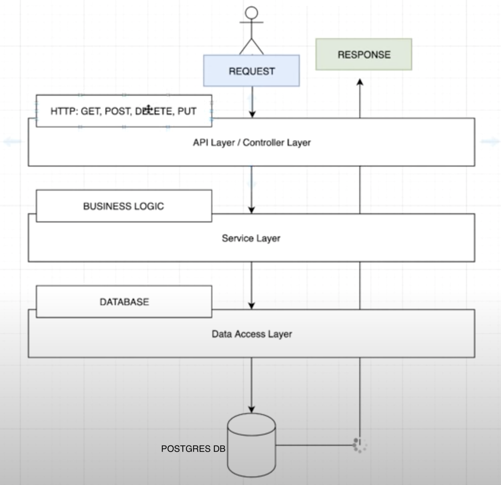

# demo-springboot-postgres
This project is an application of Spring Boot with Java and Postgres on Docker. The goal is to complete one whole cycle from API > Service > IMPL  > Postgres and vice versa.

Refer to diagram below.

Dependencies:
------------
    - Development artificacts:
        spring-boot-starter-web  // Supports HTTP requests such as GET, POST, PUT, DELETE, etc.
        java                     // You may use versions above 8, I used version 16
        postgresql               // "postgres:alpine" version is used since this is just a light weight app
        flyway-core              // In-charge with migration of data and validation of migration defined at 'V1__Persontable.sql' after connection with DB is established.
        spring-jdbc              // Support SQL query, updates, queryforObject methods Postgres
        HikariCP                 // Loads the configuration 'app:datasource' for Postgres on docker at application.yml

    - Test artifacts:
        spring-boot-starter-test
        assertj-core
    

This application supports an CRUD API for Person. The person object is described below.

Person
----------
{

     - id: UUID        // This is auto-generated by the system when you ADD a person
     - name: String    // Full name of a person; value must not be null
     - birthday: Date  // Format is yyyy-mm-dd eg. "2020-07-23"
     - email: String   // Email address should be unique and value is not null
     - address: String // Home address of the person

}

